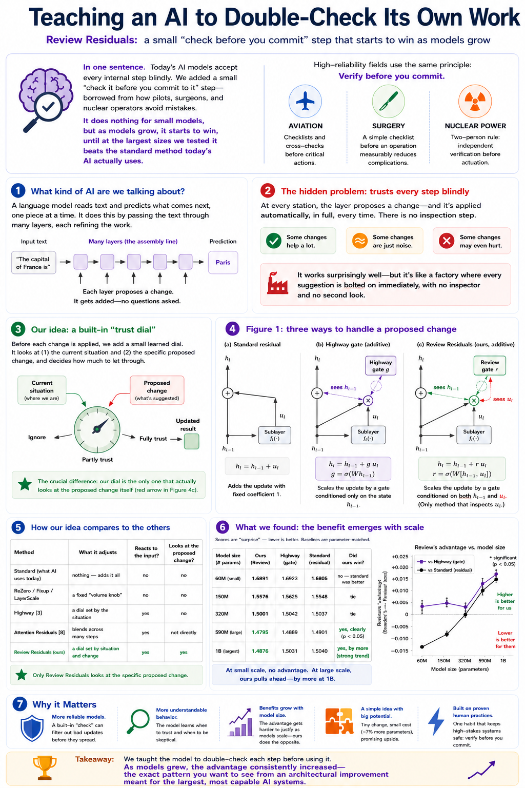
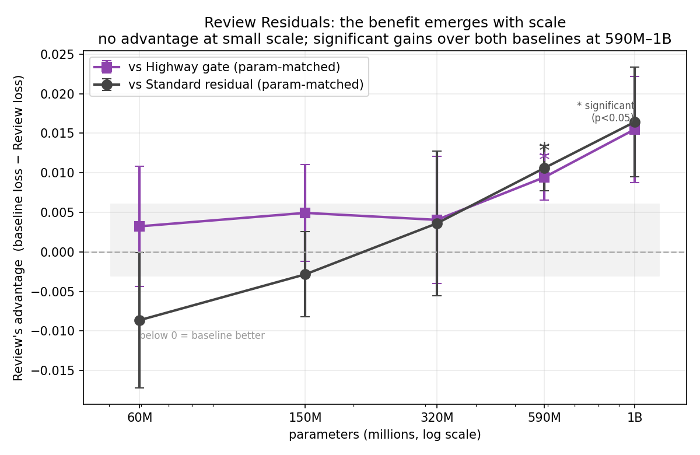

# Review Residuals

**An update-conditioned residual gate whose advantage emerges at scale.**

Review Residuals scale each transformer sublayer's proposed update by a small learned gate conditioned on
*both* the current state **and** the proposed update — an in-network analogue of the human-performance practice
of *independent verification*: check a proposed action before committing to it.

<p align="center">
  
</p>

## TL;DR

Trained from scratch (60M–1B parameters, multiple seeds, TinyStories), with both baselines **parameter-matched
up** to Review so any win is *not* a capacity advantage:

| Model size | Review (ours) | Highway | Standard residual | Review wins? |
|---|:--:|:--:|:--:|:--|
| 60M  | 1.6891 | 1.6923 | **1.6805** | no — standard is slightly better |
| 150M | 1.5576 | 1.5625 | 1.5548 | tie |
| 320M | **1.5001** | 1.5042 | 1.5037 | tie (barely ahead) |
| 590M | **1.4795** | 1.4889 | 1.4901 | **yes, significant** (p<0.05) |
| 1B   | **1.4876** | 1.5031 | 1.5040 | **yes, by more** (strong trend) |

*(Validation loss; lower is better.)* The advantage **grows with scale** rather than fading: absent at small
scale, statistically significant over both a Highway gate and the plain standard residual at 590M, and larger
at 1B. We also report a **depth-stability finding**: a convex (Highway-style) form of the gate reintroduces
vanishing gradients and fails to train past ~20 layers, while the additive, identity-preserving form trains
stably at all depths tested.



## Method

```
h_l = h_{l-1} + r_l ⊙ u_l ,    r_l = σ( W · [ RMSNorm(h_{l-1}), RMSNorm(u_l) ] )
```

where `u_l` is the sublayer's proposed update. The gate is added (identity path preserved), and — uniquely — is
conditioned on the update itself. See `paper/mechanism_additive.png`.

## Repository layout

```
paper/   the technical paper + plain-English companion (PDF + LaTeX source + figures)
src/     training/eval code, the cloud-GPU notebook, and analysis/figure scripts
data/    scaling_v8.csv — the per-run validation losses behind every number in the paper
Old/     superseded drafts, intermediate runs, and earlier (convex-form) figures
```

## Reproduce

Install: `pip install -r requirements.txt` (training needs a CUDA GPU; 590M/1B need ~80GB).

1. **Verify the analysis (no GPU):**
   `python src/analyze_results.py` — reproduces the results table and Welch *t*-tests from `data/scaling_v8.csv`.
2. **Regenerate the figure:**
   `python src/make_emergence_figure.py` — rebuilds `paper/emergence_curve.png` from the data.
3. **Re-run training (GPU):**
   `python src/train.py` — trains the full sweep (Review vs parameter-matched Highway and standard, 60M–1B,
   multi-seed). Resumable; writes `scaling_v8.csv`. `src/run_on_runpod.ipynb` wraps this for a rented cloud GPU.

## Limitations

Stated plainly (see the paper's Limitations section): in absolute terms the effect is small at the ≤1B scales we
could afford (~1% of loss), and the 1B result is a strong trend rather than significant at p<0.05; the study is
single-dataset (TinyStories), undertrained under a fixed token budget, and below frontier scale. But the
magnitude is **not static** — it grows across the tested range (negative at 60M to +0.016 nats at 1B). The
caveat is the absolute size at ≤1B, not the direction, which points upward.

## Papers

- `paper/review_residuals.pdf` — the technical paper.
- `paper/review_residuals_plain_english.pdf` — an illustrated, jargon-free companion.

## Citation

```bibtex
@misc{kramer2026reviewresiduals,
  title  = {Review Residuals: Update-Conditioned Residual Gating for Transformers},
  author = {Kramer, Kyle},
  year   = {2026},
  note   = {NeraTech LLC}
}
```

## License

Licensed under the **Apache License 2.0** — see [`LICENSE`](LICENSE) and [`NOTICE`](NOTICE).
Permissive reuse with attribution, plus an explicit patent grant. If you use this work, please cite it (above)
and preserve the `NOTICE`.

## Links

- **Paper (arXiv):** _link added after posting_ — `arXiv:XXXX.XXXXX`
- **Code (GitHub):** `https://github.com/<your-username>/review-residuals`
- **Data + artifacts (Hugging Face):** `https://huggingface.co/datasets/<your-username>/review-residuals`

> Replace the `<your-username>` / `arXiv:XXXX.XXXXX` placeholders once the repos and preprint are live.

---
Kyle Kramer · NeraTech LLC · 2026
